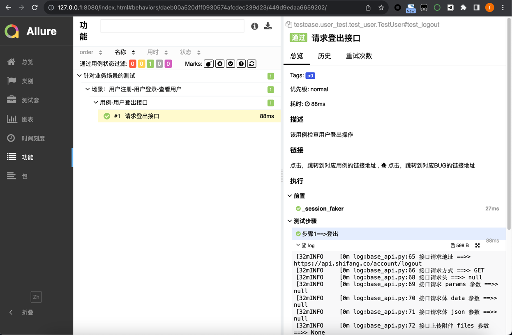

# WebApiTest-tmpl

本项目实现web接口自动化的技术选型：**Python+Requests+Pytest+YAML+Allure** ，通过 Python+Requests 来发送和处理HTTP协议的请求接口，使用 Pytest 作为测试执行器，使用 YAML 来管理测试数据，使用 Allure 来生成测试报告。


## 项目说明

本项目在实现过程中，把整个项目拆分成请求方法封装、HTTP接口封装、测试数据封装，测试用例等模块。

利用Python把HTTP接口封装成Python接口，接着把这些Python接口组装成一个个的关键字，再把关键字组装成测试用例，而测试数据则通过YAML文件进行统一管理，然后再通过Pytest测试执行器来运行这些脚本，并结合Allure输出测试报告。


## 项目部署

首先，下载项目源码后，在根目录下找到 ```requirements.txt``` 文件，然后通过 pip 工具安装 requirements.txt 依赖，执行命令：

```
pip3 install -r requirements.txt
```


## 项目结构

- apis ====>> 接口封装层，如封装HTTP接口为Python接口
- utils ====>> 各种工具类
- apis.base.base_api ====>> requests请求方法封装、关键字返回结果类
- case_data ====>> 测试数据文件管理
- requirements.txt ====>> 相关依赖包文件
- testcases ====>> 测试用例


## 测试报告效果展示

在命令行执行命令：```pytest``` 运行用例后，会得到一个测试报告的原始文件，但这个时候还不能打开成HTML的报告，还需要在项目根目录下，执行命令启动 ```allure``` 服务：

```
# 需要提前配置allure环境，才可以直接使用命令行
allure serve ./report
```

最终，可以看到测试报告的效果图如下：

也可以直接执行run.sh